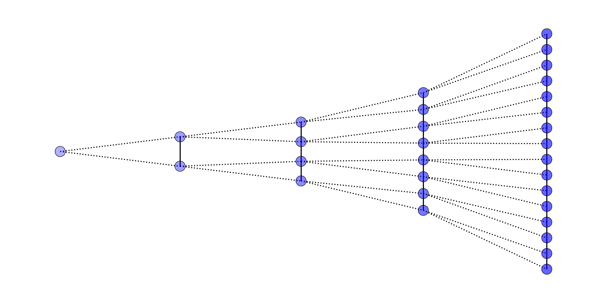
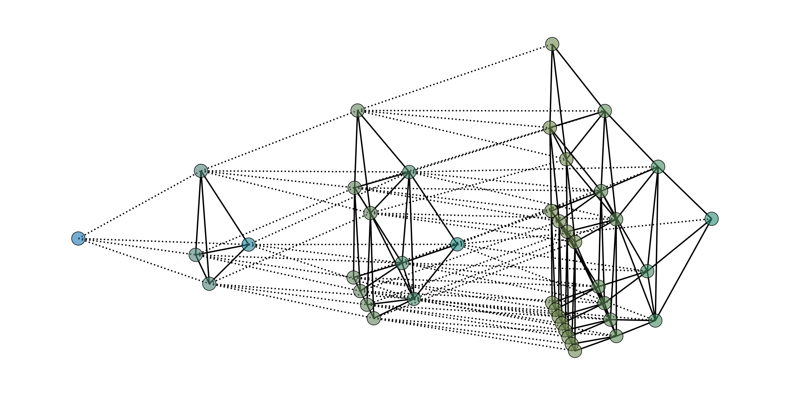

# Skeletal Graph Products
This repository contains code to compute and visualize "skeletal" products of graphs, as described in "Graph Lineages and Skeletal Graph Products", currently under review (arXiV link TBD).

Skeletal graph products are sparsified versions of the typical "box" and "cross" products defined on graphs. They have several nice properties which we demonstrate in the above paper.

## Graph Lineages

A graph lineage is loosely defined as a series of graphs indexed by a "level number", in which the graphs grow exponentially with index. Successive levels are related by bipartite graphs representing sparse ancestry relationships. For example, this is a graph lineage of path graphs of size 2^n.

For technical definitions and properties, see the paper.

## Skeletal unary and binary operations

In the paper we also define several ways to produce graph lineages from other lineages:
- Thickening: takes in a lineage G and produces a new graph lineage G' where each level L of G' contains all of the nodes whose index is <= L in G. Nodes in G' are connected to their descendant in G as well as several copies of themselves. Here is a thickened path graph lineage:

## glineage.py

This file contains the GraphLineage class, as well as subclasses for specific kinds of graph lineages (path graphs, random graphs, grid graphs).

Create a GraphLineage object by passing two lists of torch sparse tensors:

` g_lin = GraphLineage(graph_list, prolong_list) `

graph_list is a list of sparse tensors where the $i$th list element is an $n_i \times n_i$ sparse tensor representing the adjacency matrix of the $i$th graph.

prolong_list is a list of sparse tensors where the $i$th list element is an $n_i \times n_{i+1}$ sparse tensor representing the connections between the $i$th graph ans the $i+1$st graph.

Levels of the graph lineage can be decorated with feature matrices with

`g_lin.setX(T, i)`

where $T$ is a $n_i \times F$ matrix of per-node F-dimensional feature vectors which we want to assign to the $n_i$ nodes of the ith graph.

The graph lineage class has a method thicken() which returns a new GraphLineage object representing the thickened lineage.

Skeletal products are calculated by overloading python's `+, *,` and `%` binary operators as follows (G and H are both GraphLineage objects):  

- G + H: skeletal box product of G and H.
- G * H: skeletal cross product of G and H.
- G % H: the skeletal "strong" product, AKA the union of G+H and G*H.

The glineage.py file also contains utility functions for converting between a GraphLineage object and a saved .npz compact format, as well as utilities for converting between various kinds of sparse tensors (e.g. Torch -> numpy). 
